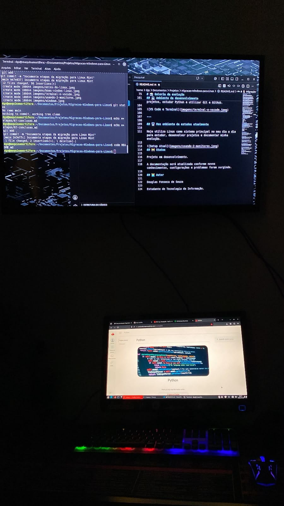
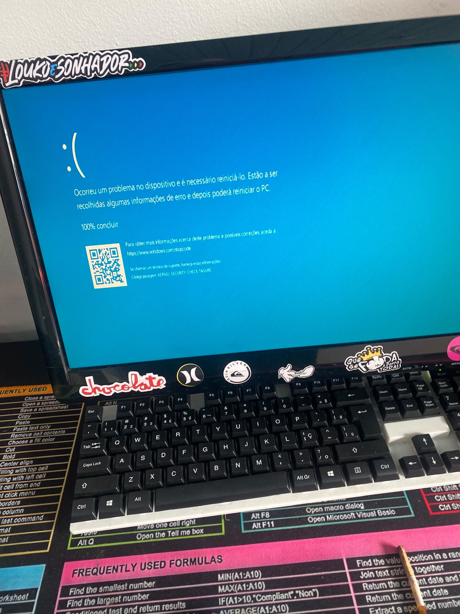
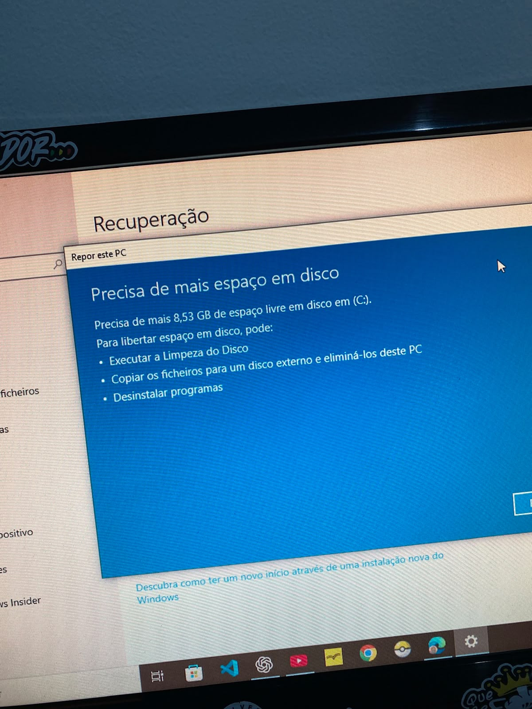
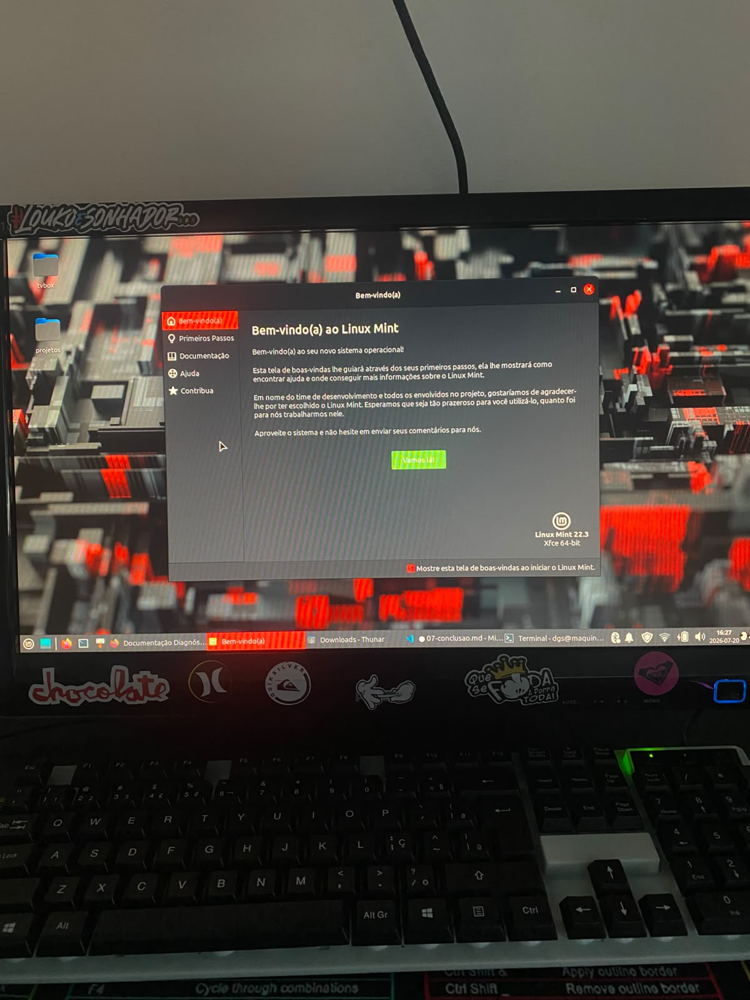
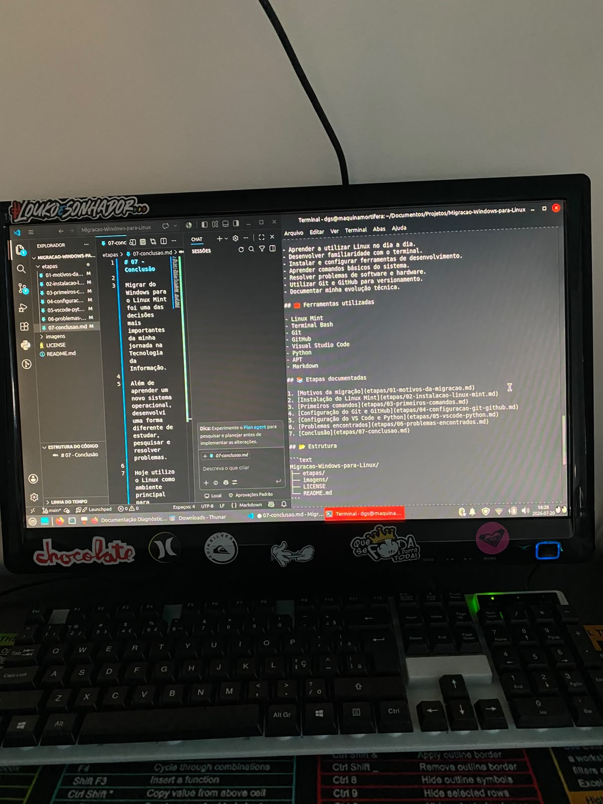
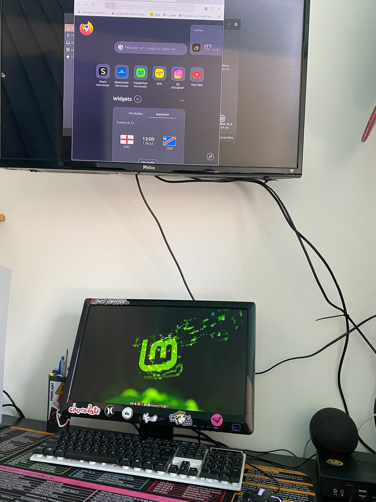

# 🐧 Migração do Windows para o Linux Mint





## 📖 Sobre o projeto

Este repositório documenta uma das mudanças mais importantes da minha trajetória na Tecnologia da Informação: a migração definitiva do Windows para o Linux Mint.

Durante muitos anos utilizei o Windows como meu sistema operacional principal. Ao iniciar minha transição para a área de Tecnologia da Informação, percebi que precisava de um ambiente mais estável, eficiente e alinhado às ferramentas utilizadas por muitos profissionais.

A mudança exigiu sair completamente da minha zona de conforto. No início enfrentei dificuldades para utilizar o terminal, instalar programas, configurar ferramentas e entender a organização do sistema.

Com o tempo, essas dificuldades deram lugar ao aprendizado. Passei a utilizar o terminal diariamente, aprendi Git, GitHub, Visual Studio Code, Python e comecei a documentar meus projetos de forma organizada.

A migração não representou apenas a troca de um sistema operacional, mas uma mudança na forma como estudo, organizo meus projetos e enfrento desafios técnicos.

Este projeto registra toda essa evolução.

---

# 💻 Como era meu ambiente antes

Antes da migração, utilizava Windows diariamente para estudar.

Embora fosse um sistema conhecido para mim, comecei a perceber algumas limitações que atrapalhavam meu aprendizado:

- O sistema já não atendia às minhas necessidades de estudo e desenvolvimento, principalmente após iniciar minha transição para a área de TI
- Ambiente pouco voltado para desenvolvimento.
- Dependência quase total da interface gráfica.
- Pouco contato com ferramentas utilizadas no mercado de TI.
- Organização dos projetos menos eficiente.

Essas dificuldades despertaram o interesse em aprender Linux e compreender melhor como um sistema operacional funciona.
---

## 🎯 Objetivos

- Aprender a utilizar Linux no dia a dia.
- Desenvolver familiaridade com o terminal.
- Instalar e configurar ferramentas de desenvolvimento.
- Aprender comandos básicos do sistema.
- Resolver problemas de software e hardware.
- Utilizar Git e GitHub para versionamento.
- Documentar minha evolução técnica.
---

## 🧰 Ferramentas utilizadas

- Linux Mint
- Terminal Bash
- Git
- GitHub
- Visual Studio Code
- Python
- APT
- Markdown
---

## 📚 Etapas documentadas

1. [Motivos da migração](etapas/01-motivos-da-migracao.md)
2. [Instalação do Linux Mint](etapas/02-instalacao-linux-mint.md)
3. [Primeiros comandos](etapas/03-primeiros-comandos.md)
4. [Configuração do Git e GitHub](etapas/04-configuracao-git-github.md)
5. [Configuração do VS Code e Python](etapas/05-vscode-python.md)
6. [Problemas encontrados](etapas/06-problemas-encontrados.md)
7. [Conclusão](etapas/07-conclusao.md)
---

## 📂 Estrutura

```text
Migracao-Windows-para-Linux/
├── etapas/
├── imagens/
├── LICENSE
└── README.md
```
---

# 📸 Galeria da evolução

## 🖥️ Meu ambiente antes da migração

Antes de iniciar minha jornada no Linux, utilizava o Windows como sistema principal para estudar.



---

## 🤔 A decisão de mudar

Com o tempo percebi que precisava de um ambiente mais alinhado ao desenvolvimento de software e às ferramentas utilizadas na área de TI.



---

## 🎉 Primeira inicialização do Linux Mint

Este foi o momento em que comecei oficialmente minha migração para o Linux Mint.



---

## 💻 Ambiente de desenvolvimento

Após a configuração inicial, passei a utilizar o Visual Studio Code integrado ao terminal Linux para desenvolver projetos, estudar Python e utilizar Git e GitHub.



---

## 🖥️ Meu ambiente de estudos atualmente

Hoje utilizo Linux como sistema principal no meu dia a dia para estudar, desenvolver projetos e documentar minha evolução.



---

## 🚧 Status


Projeto em desenvolvimento.

A documentação será atualizada conforme novos conhecimentos, configurações e problemas forem surgindo.

---

## 📈 O que mudou depois da migração

Após utilizar o Linux como sistema principal, percebi mudanças importantes:

- Maior organização dos projetos.
- Familiaridade com o terminal.
- Utilização diária do Git e GitHub.
- Ambiente preparado para programação.
- Mais autonomia para resolver problemas.
- Melhor compreensão do funcionamento do sistema operacional.
- Evolução constante na documentação técnica.

---

## 🚀 Próximos objetivos

- Aprimorar meus conhecimentos em Linux.
- Aprender Docker.
- Estudar Redes de Computadores.
- Desenvolver aplicações em Python.
- Aprender Desenvolvimento Web.
- Estudar Segurança da Informação.
- Continuar expandindo meu portfólio no GitHub.

## 👨‍💻 Autor

Douglas Fonseca de Souza

Estudante de Tecnologia da Informação.

---

> "A melhor forma de aprender tecnologia foi deixar de apenas utilizá-la e começar a entendê-la."